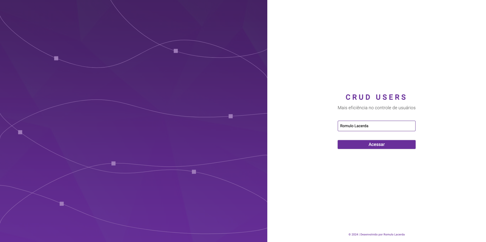

# Crud Users

## Descrição
O Crud Users é uma aplicação desenvolvida para gerenciar usuários e seus benefícios de forma eficiente. A interface é intuitiva e permite a adição, edição e exclusão de usuários, além de fornecer um dashboard com informações relevantes sobre o sistema.

## Funcionalidades
- Cadastro de usuários
- Edição e exclusão de usuários
- Visualização de benefícios
- Dashboard com estatísticas do sistema

## Tecnologias Utilizadas
A aplicação foi desenvolvida utilizando as seguintes tecnologias:

- **Angular**: Framework para construção de aplicações web.
- **Firebase**: Plataforma para autenticação e gerenciamento de dados.
- **Bootstrap**: Framework CSS para design responsivo.

## Dependências Principais
As principais dependências utilizadas no projeto, conforme o `package.json`, incluem:

- `@angular/animations`: ^17.0.0
- `@angular/cdk`: ^17.0.4
- `@angular/common`: ^17.0.0
- `@angular/compiler`: ^17.0.0
- `@angular/core`: ^17.0.0
- `@angular/fire`: ^17.1.0
- `@angular/forms`: ^17.0.0
- `@angular/material`: ^17.0.4
- `@angular/router`: ^17.0.0
- `bootstrap`: ^5.3.3
- `firebase`: ^10.12.3
- `rxjs`: ~7.8.0
- `zone.js`: ~0.14.2

## Scripts
Os seguintes scripts estão disponíveis para facilitar o desenvolvimento:

- `ng`: Comando para executar o Angular CLI.
- `start`: Inicia o servidor de desenvolvimento.
- `build`: Compila a aplicação para produção.
- `watch`: Compila a aplicação em modo de desenvolvimento com observação de mudanças.
- `test`: Executa os testes da aplicação.

## Como Executar
Para executar a aplicação localmente, siga os passos abaixo:

1. Clone o repositório.
2. Navegue até o diretório do projeto.
3. Execute `npm install` para instalar as dependências.
4. Execute `npm start` para iniciar a aplicação.

## Contribuição
Contribuições são bem-vindas! Sinta-se à vontade para abrir issues ou pull requests.

## Licença
Este projeto está licenciado sob a [MIT License](LICENSE).
